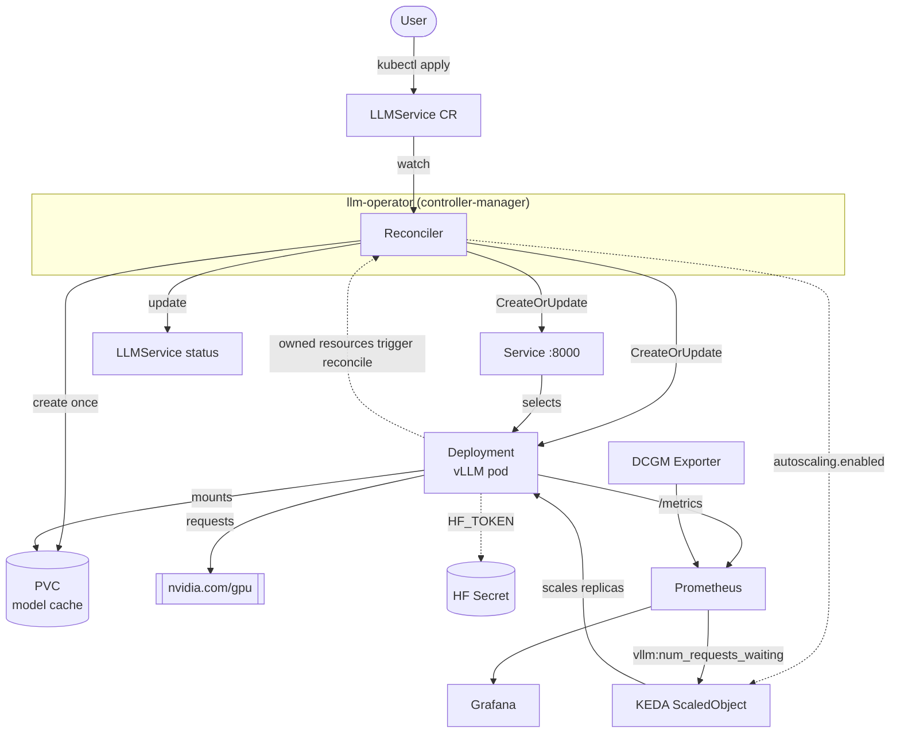

# llm-operator

[](LICENSE)

A Kubernetes operator that deploys and manages [vLLM](https://github.com/vllm-project/vllm) inference servers from a single `LLMService` custom resource.

## Features

- **One CR, full stack:** creates the Deployment, Service, and model-cache PVC
- **GPU-aware:** requests `nvidia.com/gpu`, tolerates GPU taints, mounts `/dev/shm` for tensor parallelism
- **Autoscaling:** optional [KEDA](https://keda.sh) `ScaledObject` driven by vLLM's waiting-request metric
- **Private models:** injects `HF_TOKEN` from a Kubernetes Secret
- **Observability:** Prometheus scrape annotations, plus Prometheus / Grafana / DCGM manifests
- **Status reporting:** `phase`, `readyReplicas`, `endpoint`, and a `Ready` condition

## Architecture



### Reconcile flow

1. Fetch the `LLMService`; add a finalizer on first sight.
2. `CreateOrUpdate` the **Deployment** (replicas and selector are set only on creation, so KEDA can control scaling).
3. Create the **PVC** once (its spec is immutable) and `CreateOrUpdate` the **Service**.
4. Create, update, or delete the **ScaledObject** depending on `spec.autoscaling.enabled`. If KEDA is not installed, this only fails when autoscaling is requested.
5. Update **status** from the Deployment's ready replicas.

All child resources have an owner reference to the `LLMService`, so deleting it garbage-collects them. The controller also watches Deployments, Services, and PVCs, so status stays current.

## Quick Start

**Requirements:** Go 1.25+, Docker, kubectl, a Kubernetes cluster (GPU nodes are needed to actually run vLLM).

```sh
# Local Kind cluster + KEDA + monitoring + operator, in one command
./setup-llm-operator.sh

# Or manually, against your current cluster
make install                                   # install the CRD
make deploy IMG=<registry>/llm-operator:tag    # deploy the operator
kubectl apply -f examples/serving_v1alpha1_llmservice.yaml
```

```sh
kubectl get llmservices
kubectl get deploy,svc,pvc
```

> On a cluster without GPUs the vLLM pod stays `Pending`. This is expected; the operator itself still works.

## Example

```yaml
apiVersion: serving.debasish.dev/v1alpha1
kind: LLMService
metadata:
  name: qwen-demo
spec:
  model: Qwen/Qwen2.5-1.5B-Instruct
  gpus: 1
  cacheSize: 20Gi
  hfTokenSecretRef:          # optional
    name: hf-token
    key: token
  autoscaling:               # optional, requires KEDA
    enabled: true
    minReplicas: 1
    maxReplicas: 3
    targetWaitingRequests: 5
```

When ready, the OpenAI-compatible API is served at `status.endpoint`:
`http://<name>.<namespace>.svc.cluster.local:8000`

## Spec Reference

| Field | Default | Description |
|---|---|---|
| `model` | required | Hugging Face model ID |
| `image` | `vllm/vllm-openai:v0.30.0` | vLLM container image |
| `gpus` | `1` | GPUs per pod |
| `maxNumSeqs` | `64` | vLLM `--max-num-seqs` |
| `maxModelLen` | `4096` | vLLM `--max-model-len` |
| `tensorParallelSize` | `1` | vLLM `--tensor-parallel-size` |
| `cacheSize` | `20Gi` | Model cache PVC size |
| `hfTokenSecretRef` | none | Secret name and key (key defaults to `token`) |
| `autoscaling` | disabled | `enabled`, `minReplicas`, `maxReplicas`, `targetWaitingRequests` |

## Project Layout

```
api/v1alpha1/          LLMService API types
internal/controller/   Reconciler and resource builders (deployment, service, pvc, scaledobject, status)
config/                CRD, RBAC, manager, and sample manifests (kustomize)
deploy/monitoring/     Prometheus, Grafana, DCGM exporter
examples/              Ready-to-apply LLMService examples
```

## Development

```sh
make test                 # unit + envtest suite
make lint                 # golangci-lint
make run                  # run the controller locally against your kubeconfig
make manifests generate   # regenerate CRDs and deepcopy after editing API types
./test-operator.sh        # end-to-end validation (GPU checks skipped without a GPU)
```

## Uninstall

```sh
kubectl delete llmservices --all
make undeploy
make uninstall
```

## License

Licensed under the [Apache License 2.0](LICENSE).
